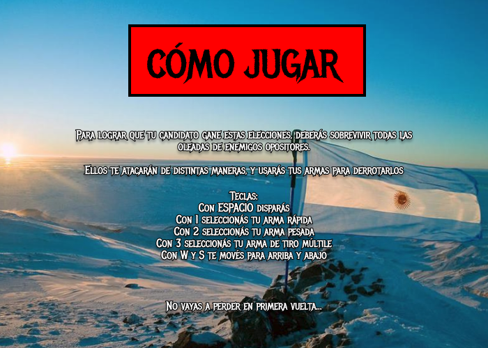

# Ballotage 23

## Developers

-   Liam Ezekiel Wilk
-   Marcos Nicolau
-   Francisco Declich
-   Celeste Dellisola

## Installation

El desarrollo de este juego se hizo con las herramientas para el ambiente de Visual Studio Code, las cuales se encontraban en proceso de desarrollo. Al comenzar el proyecto sabíamos que nos íbamos a encontrar con varios problemas e iba a retrasarnos bastantes. Y asi lo fue... Entonces, capaz usted se pregunte, ¿por que se mandaron a hacer un juego con herramientas todavía inestables? Para divertirnos pues y enfrentar esto como un desafió y asi también darles feedback a los desarrolladores.

A raíz de esto, es que tuvimos que extender las herramientas a nuestras necesidades. Por ello, para compilar y ejecutar el juego es necesario instalarla [aquí](https://github.com/MarcosNicolau/wollok-ts-cli).

## How to play

## Captures

https://github.com/pdepmartestm/2023-tpgame-dulce-de-leche-tentacion/assets/33577925/02a3e7ae-27e3-4635-a2d0-bdf0ae3a27ac

## Others

-   Curso/Facultad: Martes mañana en UTN FRBA
-   Versión de wollok: Wollok TS (modificado)
-   Una vez terminado, no tenemos problemas en que el repositorio sea público
